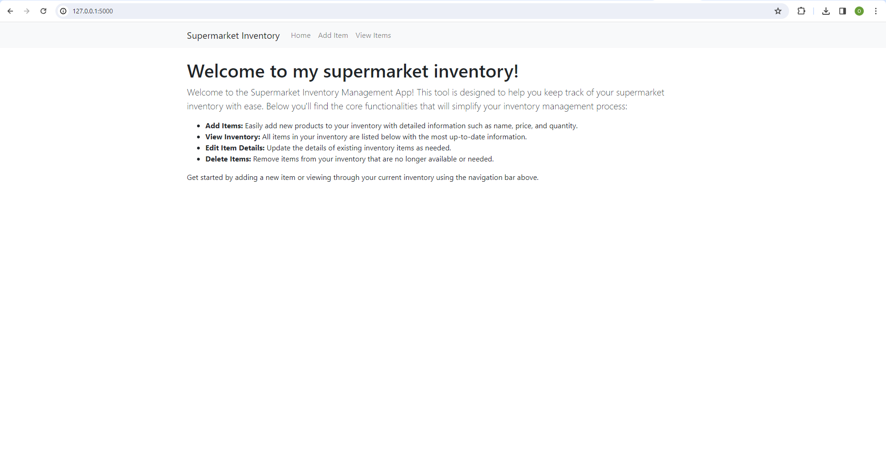
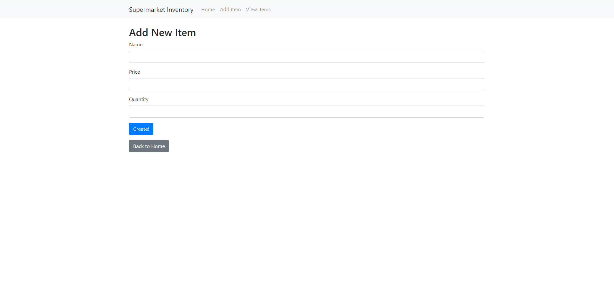
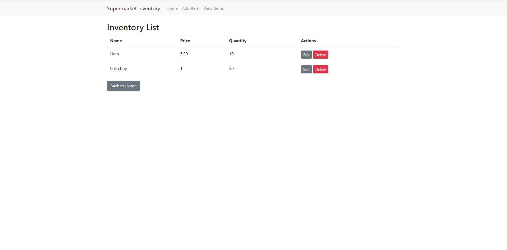

# Supermarket Inventory Manager

## Description

Supermarket Inventory Manager is a web-based application designed to help supermarket staff manage inventory efficiently. With this app, users can add new inventory items, view a list of all items, edit existing items, and remove items from the inventory. The app's intuitive interface makes inventory management straightforward and hassle-free.

## Features

- **Add New Items**: Easily input new stock items along with their prices and quantities.
- **View Inventory**: Browse through the list of all inventory items in a neatly organized table.
- **Edit Item Details**: Keep inventory information up to date by editing item entries.
- **Delete Items**: Remove items that are no longer available from the inventory list.

## Link to the deployed copy of your app
Since I can't connect to i6 sever but it works on my local computer, here is the screenshot of web pages. (.env file is already posted in the *discord sh6382 channel*)

This is the home page, providing brief explanations of the app and its functions.

This is the "add item" page, which users can freely add inventories of the market. Click *Create!* to add the item to the table, and click *Back to Home* to go back to the home page.

This is the "view inventory" page, which users can browse all inventories in the market. Click *Edit* to change the name, price and quantity of the items and click *Delete* to delete the specific item. Click *Back to Home* to go back to the home page.
